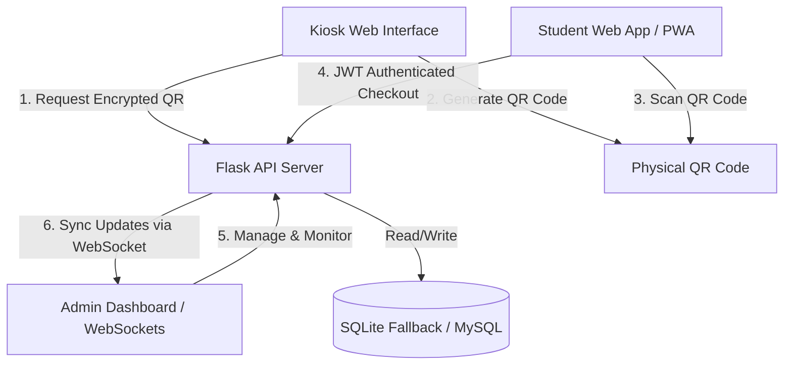

# Project Brain & Architecture Document (`BRAIN.MD`)

This document serves as the centralized source of truth for the **QR-Based Library Access & Management System**. It contains the directory layout, schema structure, data flows, implementation log, and current project state to facilitate rapid, context-rich maintenance and development.

---

## 1. System Architecture Overview

The application is structured into a backend API server and a client web application.



*   **Backend Core:** Built with **Flask** (Python 3) and integrated with **Flask-SocketIO** for WebSockets, **cryptography.fernet** for secure QR payload signing, and **APScheduler** for running daily due-date checks.
*   **Database Interface:** Leverages **PyMySQL** to query a centralized MySQL schema. If MySQL is unreachable, it automatically fallbacks to a local **SQLite** file (`library_access_sqlite.db`), executing dialect-specific queries gracefully.
*   **Frontend Core:** Designed with static HTML5 web pages, vanilla CSS (dark neon styling), and clean vanilla JavaScript controllers. Uses CDNs for **Chart.js** visual analytics and **Socket.IO** client-side syncing.
*   **PWA Shell:** Enables student portal installability on mobile and desktop devices via custom service worker cache interception.

---

## 2. Project Directory Structure

```text
QR-BASED-LIBRARY-ACCESSE/
│
├── database_schema.md        # Logical database schema and relationships design document
├── requirements.txt          # Python package requirements manifest
├── Dockerfile                # Docker execution wrapper configurations
├── README.md                 # Brief onboarding introduction
├── BRAIN.MD                  # Centralized system documentation & roadmap log (this file)
│
├── backend/                  # Server-side API source
│   ├── app.py                # Main application entry point & blueprint registration
│   ├── db.py                 # MySQL controller / SQLite fallback database manager
│   ├── extensions.py         # Standalone socketio instantiation (prevents circular imports)
│   ├── reminders.py          # Daily due-date cron scheduler & email dispatch mock
│   ├── test_workflow.py      # Automated integration verification test suite
│   ├── library_access_sqlite.db # SQLite database local storage fallback file
│   │
│   └── routes/               # API route Blueprints
│       ├── auth.py           # JWT Authentication wrapper decorator
│       ├── books.py          # Book details lookup & QR encryption endpoints
│       ├── admin.py          # Administrator logs, returns, analytics, and CSV export routes
│       └── student.py        # Student login, active checkout querying, and scan actions
│
└── frontend/                 # Client-side static portal
    ├── index.html            # General landing index portal
    ├── style.css             # Unified entry stylesheet linking component sheets
    ├── config.js             # API base URL configuration mappings
    ├── icon.svg              # Vector logo (PWA application icon)
    ├── manifest.json         # PWA metadata configuration file
    ├── sw.js                 # Service worker offline caching logic
    │
    ├── css/                  # Component-based modular stylesheets
    │   ├── base.css          # Design system variables, global resets, body styles
    │   ├── forms.css         # Form wrappers, labels, text inputs, buttons
    │   ├── tables.css        # Table matrices, columns, status badges
    │   └── components.css    # QR cards, laser overlays, book badges, toasts
    │
    ├── student-login.html    # Student authorization gate
    ├── student-dashboard.html# Student scanner viewport
    ├── student.js            # Student auth controllers
    ├── student-dashboard.js  # QR scanner bindings and active checkouts querying
    │
    ├── admin-login.html      # Admin portal entrance
    ├── admin-dashboard.html  # Admin control page (Inventory, Checkouts, Fines, Analytics)
    ├── admin.js              # Admin authentication handlers
    └── admin-dashboard.js    # Data loading, CSV exporters, and Chart.js dashboards
```

---

## 3. Database Schema Blueprint

The system relies on four primary tables representing users, books, checkout transactions, and penalties.

### A. Users (`users`)
Stores profile metadata, credentials, and access roles.
*   `id` (INTEGER, Primary Key): Unique database ID.
*   `roll_number` (TEXT, Unique, Nullable): Roll number (required for students, null for admins).
*   `name` (TEXT, Not Null): Full name of the user.
*   `email` (TEXT, Unique, Not Null): Institution email.
*   `password_hash` (TEXT, Not Null): SHA/Bcrypt password hash.
*   `role` (TEXT, Not Null): Access permissions: `'student'` or `'admin'`.

### B. Books (`books`)
Tracks physical book status and lab slot allocation.
*   `id` (INTEGER, Primary Key): Unique book index.
*   `book_uid` (TEXT, Unique, Not Null): Unique human-readable code (e.g., `BK-ALG-101`).
*   `title` (TEXT, Not Null): Book title.
*   `author` (TEXT, Not Null): Book author.
*   `slot_location` (TEXT, Not Null): Lab physical coordinates (e.g., `Row 1, Shelf A`).
*   `status` (TEXT, Not Null): Availability status: `'available'`, `'checked_out'`, or `'maintenance'`.

### C. Transactions (`transactions`)
Records checkouts and check-ins.
*   `id` (INTEGER, Primary Key): Unique transaction index.
*   `user_id` (INTEGER, Foreign Key -> `users(id)`): Student who checked out the book.
*   `book_id` (INTEGER, Foreign Key -> `books(id)`): The checked-out book.
*   `checkout_time` (TIMESTAMP, Default Current): Date and time of scan checkout.
*   `due_time` (TIMESTAMP, Not Null): Time when book is due (usually `checkout_time` + 14 days).
*   `return_time` (TIMESTAMP, Default Null): Time when book was returned (Null if active).
*   `status` (TEXT, Not Null): Current transaction status: `'active'`, `'returned'`, or `'overdue'`.

### D. Overdue Fines (`fines`)
Logs overdue penalty amounts and collection status.
*   `id` (INTEGER, Primary Key): Unique fine index.
*   `transaction_id` (INTEGER, Foreign Key -> `transactions(id)`): Link to the overdue checkout.
*   `fine_amount` (REAL, Not Null): Total penalty amount calculated ($10 per day overdue).
*   `status` (TEXT, Not Null): Payment status: `'unpaid'` or `'paid'`.

---

## 4. Key Workflows & Data Flows

### A. Secure Student Checkout (QR Code Flow)
1.  **Kiosk QR Request:** Kiosk requests `GET /api/books/pickup/<book_uid>`. The backend encrypts a JSON payload `{"book_uid": "BK-ALG-101", "timestamp": "..."}` using a 256-bit Fernet AES key and returns it as a string token.
2.  **QR Display:** Kiosk generates a QR containing the raw encrypted string.
3.  **Scan & Request:** Student scans QR using their phone camera on [student-dashboard.html](file:///e:/QR-BASED-LIBRARY-ACCESSE/frontend/student-dashboard.html). JavaScript extracts the encrypted token and posts to `POST /api/student/checkout` along with their student user ID and JWT token.
4.  **Fine Restricting:** Backend queries the `fines` table. If the student has any outstanding record with `status = 'unpaid'`, the checkout request is rejected with `403 Forbidden`.
5.  **Payload Decryption:** Backend decrypts the QR string using the Fernet key. If decryption succeeds and timestamp validation passes, it resolves the `book_uid`.
6.  **Transaction Commit:** Inside a database transaction, backend inserts an `'active'` record in `transactions` (with `due_time` set to 14 days from now) and updates the book's status in `books` to `'checked_out'`.
7.  **Real-time Update:** Backend invokes `socketio.emit('checkout_update', ...)` to broadcast the checkout event to all connected admin portals, which instantly triggers an asynchronous table refresh and shows a success toast.

### B. Admin Book Return & Fine Calculation
1.  **Process Return:** Admin clicks "Mark as Returned" on the dashboard, sending a request to `POST /api/admin/return-book` containing the `transaction_id`.
2.  **Overdue Assessment:** Backend compares the current timestamp with `due_time`.
3.  **Fine Calculation:** If current time is past due, the backend computes the overdue duration in days (rounding up partial days) and generates a fine ($10 per day).
4.  **Database Commit:** Backend updates the transaction status to `'returned'`, sets `return_time` to current time, sets the book status to `'available'`, and inserts a new `'unpaid'` record in `fines`.
5.  **Real-time Refresh:** Emits a WebSocket event `return_update` notifying the admin portal to refresh checkout lists, analytics, and fine management records.

---

## 5. Development Log & Implementation State

### Day 17 to Day 26 Completed Log

*   **Day 17 (JWT Auth):** Implemented JWT token generation on user login. Protected backend routes with `@token_required` decorators.
*   **Day 18 (Encrypted QR):** Added Fernet AES symmetric encryption to sign kiosk QR payloads, ensuring QRs cannot be forged or tampered with.
*   **Day 19 (Reminders Scheduler):** Integrated APScheduler to run a daily background check. Send due-date reminders via mock email dispatcher. Created manual trigger endpoints.
*   **Day 20 (Fines System):** Implemented return-time overdue checking, fine calculations, payment collections, and checkout blocking logic for students with outstanding penalties.
*   **Day 21 (PWA Installability):** Configured service workers caching student dashboard assets and defined manifest configurations enabling PWA installation.
*   **Day 22 (Visual Analytics):** Integrated Chart.js to render a horizontal purple gradient bar chart for "Most Borrowed Books" and a smooth cyan line chart representing "Peak Checkout Hours".
*   **Day 23 (CSV Exporter):** Implemented admin transactions exporter. Admins can click "Download Report" to download a full CSV log.
*   **Day 24 (WebSockets Live Sync):** Integrated Flask-SocketIO. Admin dashboard updates checkouts, inventory, fines, and analytics in real-time when checkout or return commits occur.
*   **Day 25 & 26 (CSS Modularization & Refactoring):** Split the massive `style.css` stylesheet into four component sheets inside a dedicated `css/` directory. Linked them via imports back into the main `style.css` to clean up technical styling debt.
*   **Day 27 (Backend Unit Testing):** Installed pytest and created comprehensive route unit tests (`backend/test_routes.py`) validating API health checks, student login credentials checking, QR payload encryption, checkout fine blocking restrictions, double checkout prevention, and transactional rollback stability under database operational conflicts.

### Current Implementation State (Where we are now)

*   **Current State:** Phase 6 and Day 27: Backend Unit Testing are fully completed and verified locally using pytest.
*   **Next Milestone:** **Day 28: UI/UX Styling Refinements & User Feedback Loops**.

---

## 6. Project Setup & Execution Commands

### A. Environment Configuration
Create a `.env` file in the root containing:
```env
DB_HOST=localhost
DB_USER=root
DB_PASSWORD=yourpassword
DB_NAME=library_access_db
PORT=5000
QR_ENCRYPTION_KEY=Op3ob-qUHFyWRuEBOuGS-L3l8T8CbtDtGVoIAe87vgc=
```

### B. Installing Dependencies
Install packages inside the virtual environment:
```powershell
.\.venv\Scripts\pip.exe install -r requirements.txt
```

### C. Running the Backend Server
Start the Flask Socket.IO server:
```powershell
.\.venv\Scripts\python.exe backend/app.py
```

### D. Running the Frontend Server
Start a local HTTP server inside the `frontend` folder:
```powershell
# Run from the frontend/ directory
..\.venv\Scripts\python.exe -m http.server 8000
```
Access points:
*   Student Portal Login: `http://localhost:8000/student-login.html`
*   Admin Portal Entrance: `http://localhost:8000/admin-login.html`
*   Portal Home Directory: `http://localhost:8000/index.html`

### E. Executing Verification Tests
Run the comprehensive integration test suite verifying health, checkouts, returns, reminders, fines, CSV export, and WebSockets:
```powershell
# Run from the backend/ directory
..\.venv\Scripts\python.exe -u test_workflow.py
```
