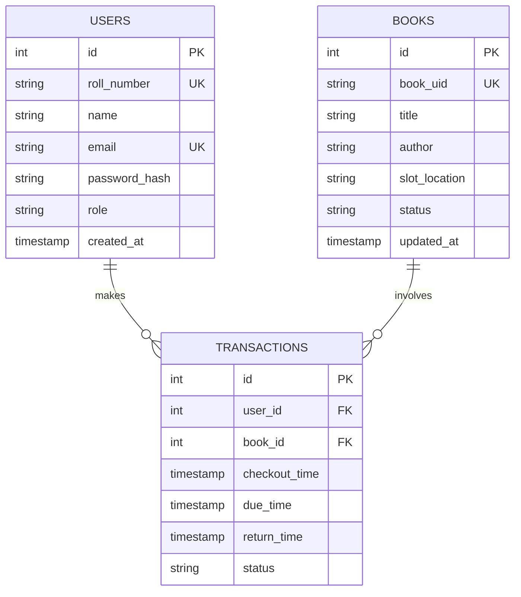

# Database Schema Design - Library Kiosk System

This document outlines the logical database design for the QR-Based Library Access System. It defines the tables, columns, constraints, and relationships required to manage users, books, and transactions.

---

## 1. Table: `users`
This table stores registration, credentials, and role information for both students and administrators.

| Column Name | Data Type | Constraints | Description |
| :--- | :--- | :--- | :--- |
| `id` | INT / UUID | Primary Key, Auto-increment | Unique identifier for each user |
| `roll_number` | VARCHAR(50) | Unique, Nullable | Academic roll number (Required for students, Nullable for Admins) |
| `name` | VARCHAR(100) | Not Null | Full name of the student or administrator |
| `email` | VARCHAR(100) | Unique, Not Null | Institutional email address |
| `password_hash` | VARCHAR(255) | Not Null | Securely hashed password |
| `role` | VARCHAR(20) | Not Null | User role: `'student'` or `'admin'` |
| `created_at` | TIMESTAMP | Default CURRENT_TIMESTAMP | Date and time when the user was registered |
| `updated_at` | TIMESTAMP | Default CURRENT_TIMESTAMP | Date and time when the profile was last modified |

---

## 2. Table: `books`
This table tracks the physical book inventory in the lab, including their location and current availability.

| Column Name | Data Type | Constraints | Description |
| :--- | :--- | :--- | :--- |
| `id` | INT / UUID | Primary Key, Auto-increment | Internal unique identifier for each book record |
| `book_uid` | VARCHAR(50) | Unique, Not Null | Human-readable unique book identifier (e.g. `BK-8904-XT`) |
| `title` | VARCHAR(255) | Not Null | Title of the book |
| `author` | VARCHAR(100) | Not Null | Author of the book |
| `slot_location` | VARCHAR(50) | Not Null | Physical location in the lab (e.g., `Shelf B, Slot 4`) |
| `status` | VARCHAR(20) | Not Null | Current status: `'available'`, `'checked_out'`, or `'maintenance'` |
| `created_at` | TIMESTAMP | Default CURRENT_TIMESTAMP | Date and time when the book was registered in inventory |
| `updated_at` | TIMESTAMP | Default CURRENT_TIMESTAMP | Date and time when book details or status were last updated |

---

## 3. Table: `transactions` (The Checkout Log)
This table logs all checkouts and returns, serving as the link between users and books when a QR code is scanned.

| Column Name | Data Type | Constraints | Description |
| :--- | :--- | :--- | :--- |
| `id` | INT / UUID | Primary Key, Auto-increment | Unique identifier for each transaction |
| `user_id` | INT / UUID | Foreign Key -> `users(id)`, Not Null | References the student checking out the book |
| `book_id` | INT / UUID | Foreign Key -> `books(id)`, Not Null | References the book being checked out |
| `checkout_time` | TIMESTAMP | Default CURRENT_TIMESTAMP | Date and time when the QR code was scanned for checkout |
| `due_time` | TIMESTAMP | Not Null | Calculated return date (e.g., `checkout_time` + 14 days) |
| `return_time` | TIMESTAMP | Nullable | Actual date and time when the book was returned (NULL if active) |
| `status` | VARCHAR(20) | Not Null | Transaction state: `'active'`, `'returned'`, or `'overdue'` |

---

## 4. Entity-Relationship Diagram (ERD)

---

## 5. Relationship Details

1. **Users to Transactions (One-to-Many)**
   - A `user` can have multiple `transactions` over time (checking out many books).
   - Each `transaction` points to exactly one `user` via the `user_id` foreign key.

2. **Books to Transactions (One-to-Many)**
   - A `book` can have multiple historical `transactions`.
   - Each `transaction` points to exactly one `book` via the `book_id` foreign key.
   - *Business Rule Constraint*: A book can have at most one **active** transaction (where `return_time` is NULL and `status` is `'active'` or `'overdue'`) at any point in time.
